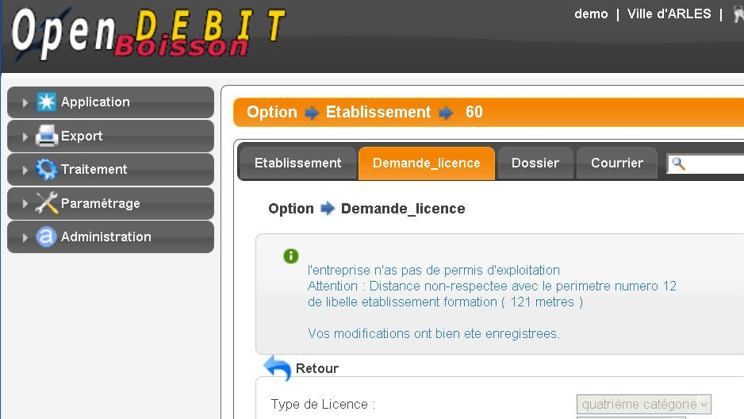

.. _conformite:

###########################################################
Les possibilités de non-conformité d'une demande de licence
###########################################################

**********************************
en rapport avec la géolocalisation
**********************************

Il y a 2 cas :

• la distance entre la géolocalisation de l'établissement de la demande de licence concernée et toute les géolocalisations de périmètre interdit pour les demandes d'ouverture et de mutation permanente n'étant pas de première catégorie
• la distance entre la géolocalisation de l'établissement de la demande de licence concernée et toutes les géolocalisations des établissements possédant une licence de même type dont la période a au moins un jour de commun avec la période de la licence demandée

****************************************************
pour tous les établissements (même non-géolocalisés)
****************************************************

Il y a 3 cas:

• pas plus de 5 demandes de licence temporaire par établissement par an.
• pas plus de 10 demandes de licence liée à un terrain de sport par établissement par an.
• l'établissement doit disposer d'un permis d'exploitation.

Un message d'erreur renseigne l'utilisateur dans ce cas.

