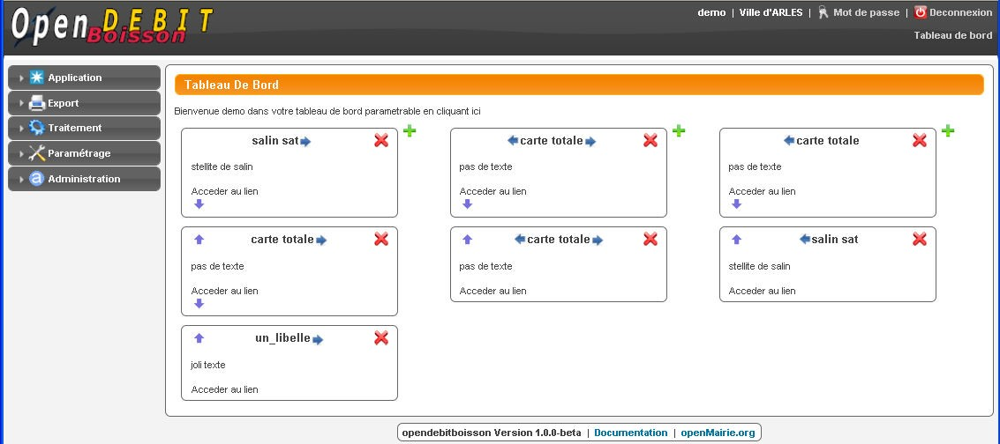

.. _ergonomie:

#########
Ergonomie
#########

************
La connexion
************

Le premier accès se fait sur la grille de choix de base de données par l'URL suivant : http://nom_du_serveur/opendebitdeboisson

Le nom du serveur est le nom du serveur web où l'application est installée

Phase d'identification :

L'utilisateur doit se connecter avec son login et son mot de passe.

Le login et le mot de passe sont donnés par l'administrateur de la base de données dans le cadre de la gestion des droits. (voir manuel administrateur)

Par défaut, c'est l'utilisateur " demo " qui s'affiche et il ne faut pas oublier d'annuler le mode démo (voir manuel administrateur)

.. image:: image2.jpeg

*******
Le menu
*******

Le menu constitue le point central de l'application où il est possible d'accéder à toutes les fonctionnalités d'openDébitDeBoisson et notamment aux :

Menu haut permanent dans l'application :

- utilisateur connecté : ici admin
- changer son mot de passe
- déconnexion
- accès au tableau de bord

Menu vertical permanent dans l'application :

- accès aux options du métier application
- accès aux éditions des tables de l'application (format PDF) et aux requêtes mémorisées
- à propos : accès au site openMairie et à la documentation en ligne
- accès aux tables de paramétrage
- administration de l'application :
- gestion des droits d'accès (mode administrateur)
- gestion des états et sous états (mode administrateur)
- gestion des widgets et tableau de bord
- gestion des cartes (om_sig_point)

******************
Le tableau de bord
******************

Le tableau de bord permet d'avoir une vue d'ensemble et des accès rapides aux différentes fonctionnalités d'openDébitDeBoisson.
Des flèches permettent le déplacement entre elles des widgets tandis que + permet de rajouter une widget et X d'en supprimer.

**********
Les icones
**********

Le mode de fonctionnement est le même dans tous les formulaires d'openMairie. Il est possible d'effectuer :

* une recherche -> zone recherche (les entêtes de colonne marquées d'une loupe sont accessible en recherche : dans notre cas : zone)

  .. image:: image4.png

* un tri sur toutes les colonnes en cliquant sur l'entête de la colonne

* Un ajout d' enregistrement

  .. image:: image5.png

* Une suppression d' enregistrement

  .. image:: image6.png

* Une modification d' enregistrement

  .. image:: image7.png

* L'édition de la fiche de récépissé (licences permanentes et temporaires).

  .. image:: image8.png

* l'Accès aux cartes

  .. image:: image9.png

