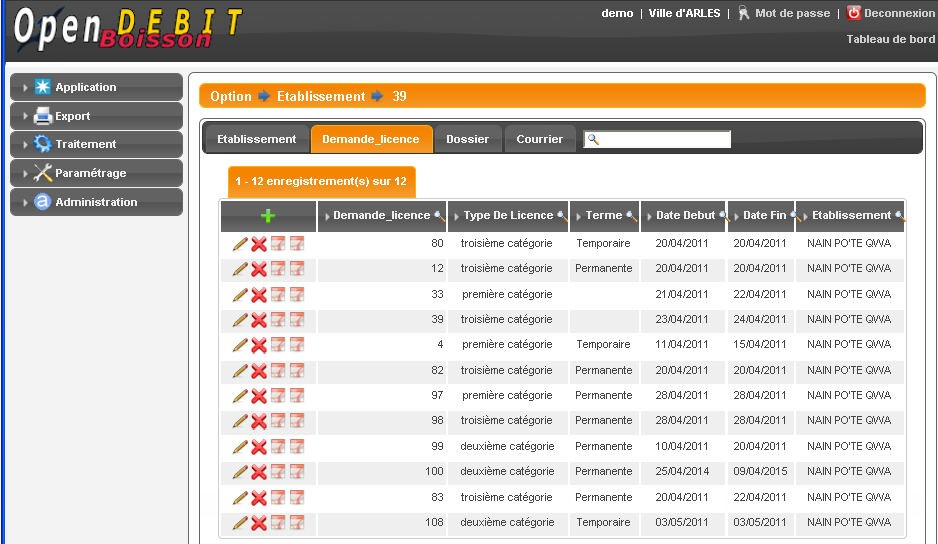

.. _instruction:

######################
Suivi de l'instruction
######################

***************************
La saisie des etablissement
***************************

Il faut obligatoirement remplir le champ suivant :

- Raison sociale

Ensuite sont à la disposition de l'utilisateur les champs suivant :

- Enseigne
- Numéro Siret
- Forme juridique
- Permis d'exploitation (oui/non)
- Date du permis d'exploitation
- localisation (avec géolocalisation)
- Coordonnées de l'exploitant
- Coordonnées du propriétaire
- Date de fermeture/liquidation

Il existe un sous-type d'établissement (appelé établissement temporaire) qui est une variante plus simplifiée d'un établissement, non-géolocalisable, ne pouvant demander que des demandes de licences temporaire ou liée à un terrain de sport.

Trois nouveaux onglets sont actifs suite à la saisie :

- onglet Demande_licence : cet onglet permet de visualiser et d'ajouter des demandes de licences liées à cette établissement.
- onglet Dossier : cet onglet permet de visualiser et d'ajouter des documents liés à cette établissement.
- onglet Courrier : cet onglet permet de rédiger des courriers personnalisés pour cet établissement.

************************************
La saisie des périmètres d'exclusion
************************************

Il faut obligatoirement remplir le champ suivant :

- Libelle

Ensuite sont à la disposition de l'utilisateur les champs suivant :

- Longueur exclusion (150mètres par défaut si champ vide)
- Localisation

*********************************
La saisie des demandes de licence
*********************************

Les demandes de licence sont accessibles par l'onglet Demande_licence en ayant sélectionné un établissement.

Il faut obligatoirement remplir les champs suivants :

- Type de demande (d'ouverture/de transfert/de mutation)
- Type de Licence (catégorie 1/2/3/4, de grande restauration, etc...)
- Terme (Permanente, Temporaire, Liée à un terrain de sport)

Ensuite sont à la disposition de l'utilisateur les champs suivant :

- Date de début
- Date de fin
- Heure de début
- Heure de fin

***********************
Vérification sur le SIG
***********************

Si le code rue existe et si le numéro dans la rue existe, il est possible de vérifier l'adresse dans le SIG en appuyant sur

Voir manuel administrateur pour paramétrer le lien SIG (ici dynmap)

