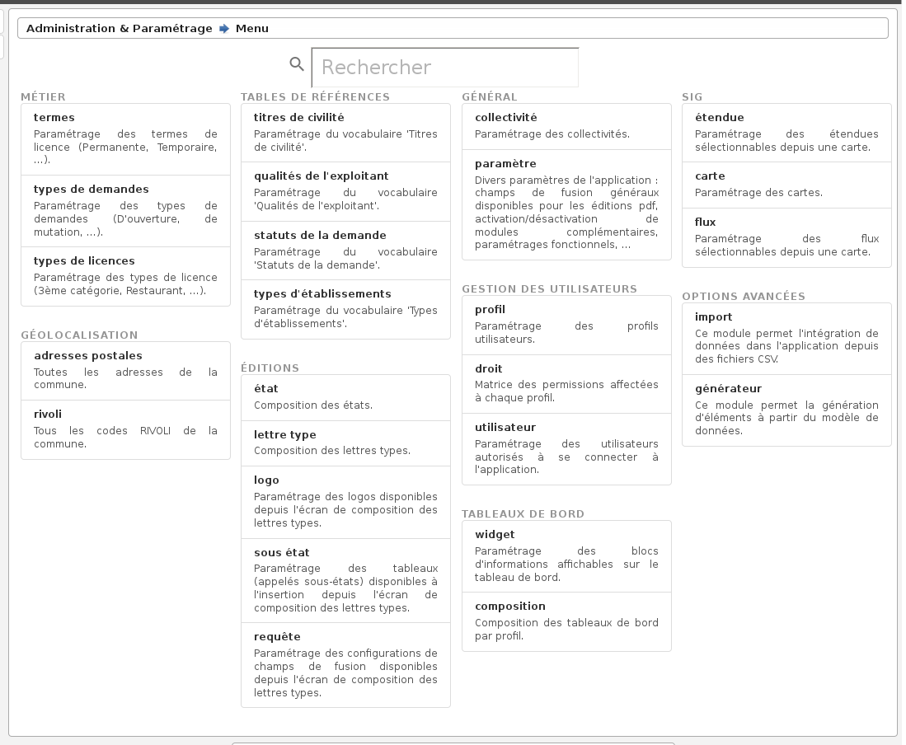

.. _administration:

############################
Administration & Paramétrage
############################

Une section dédiée à l'administration et au pamétrage permet de configurer l'application : saisir les données des tables de références, gérer les utilisateurs, paramétrer les éditions PDF, ... Pour y accéder, un lien est disponible dans les actions 'raccourcis'.

    Raccourci 'Administration & Paramétrage'

Un menu permet de lister tous les écrans d'administration et paramétrage disponibles pour le profil de l'utilisateur connecté. Une recherche permet de filtrer les éléments disponibles dans ce menu.

    Menu 'Administration & Paramétrage'

Dans ce paragraphe il est décrit les principaux éléments pour le manuel utilisateur, si un élément n'est pas décrit ici, il faut se référer au guide du développeur du framework openMairie :
https://docs.openmairie.org/?project=framework&version=4.9&format=html&path=usage/administration

*****************
Termes de licence
*****************

Un terme de licence permet de caractériser une demande de licence. Ils sont utilisés dans le formulaire de demande de licence et de demande de licence temporaire.

De base les demandes de licence peuvent être :

• " Permanente ".
• " Temporaire ".
• " Liée à un terrain de sport ".

****************
Types de demande
****************

Il s'agit des types de demande de licence.

Ils sont utilisés dans le formulaire de demande de licence et de demande de licence temporaire.

De base ils peuvent être :

• " D'OUVERTURE ".
• " DE TRANSFERT ".
• " DE MUTATION ".

***************************
Saisie des " Type_licence "
***************************

paramétrage => Type_licence

Il s'agit des types de licence.

Ils sont utilisés dans le formulaire de demande de licence et de demande de licence temporaire.

De base ils peuvent être :

• " première catégorie ".
• " deuxième catégorie ".
• " troisième catégorie ".
• " quatrième catégorie ".
• " petite à emportée ".
• " grande à emportée ".
• " petite restauration ".
• " grande restauration ".

