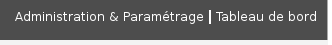
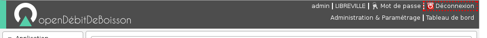
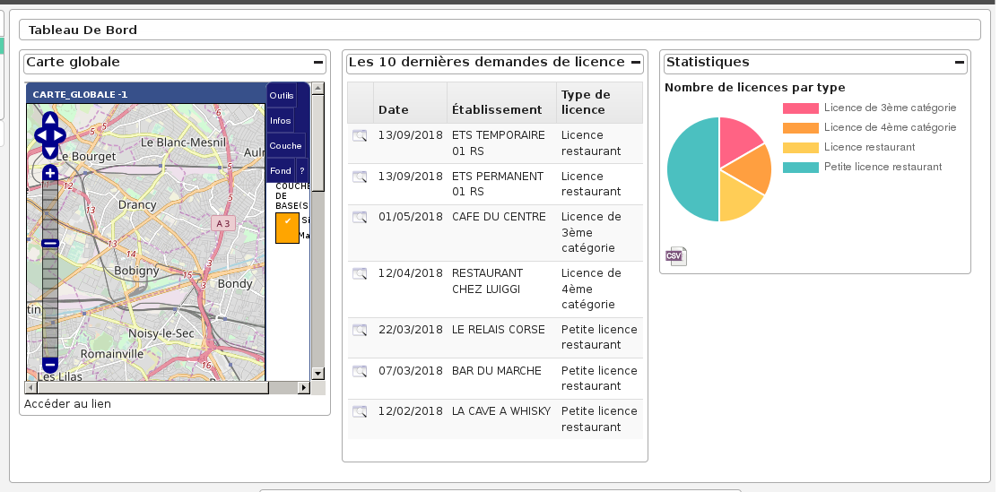
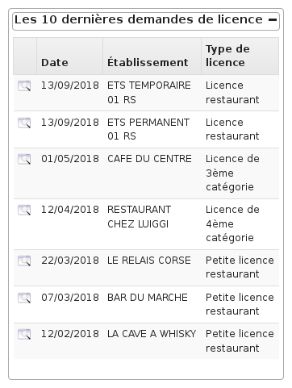

.. _ergonomie:

#########
Ergonomie
#########

.. _ergonomie_generale:

******************
Ergonomie générale
******************

L'application, sur la grande majorité des écrans, conserve ses composants
disposés exactement au même endroit. Nous allons décrire ici le fonctionnement
et l'objectif de chacun de ces composants. Cette structuration de l'application
permet donc à l’utilisateur de toujours trouver les outils au même endroit
et de se repérer rapidement.

    Ergonomie générale

.. note::

    Les actions et affichages de l'application diffèrent en fonction du profil
    de l'utilisateur. Il se peut donc que dans les paragraphes qui suivent
    des actions soient décrites et n'apparaissent pas sur votre interface
    ou inversement que des actions ne soient pas décrites mais apparaissent sur
    votre interface.

=======
Le logo
=======

C'est le logo de l'application, il vous permet en un seul clic de revenir
rapidement au tableau de bord.

    Logo

========================
Les actions personnelles
========================

Cet élément affiche plusieurs informations importantes.

La première information est l'identifiant de l'utilisateur actuellement
connecté ce qui permet de savoir à tout moment si nous sommes bien connectés
et avec quel utilisateur. Ensuite est noté le nom de la collectivité sur
laquelle nous sommes en train de travailler. En mode multi, une action est
disponible sur cette information pour permettre de changer de collectivité.
Ensuite la liste sur laquelle nous sommes en train de travailler, une action
est disponible sur cette information pour permettre de changer de liste.
Enfin l'action pour permettre de changer de mot de passe et pour se déconnecter
sont disponibles en permanence.

    Actions personnelles

==============
Les raccourcis
==============

Cet élément permet d'afficher des raccourcis vers des écrans auxquels nous
avons besoin d'accéder très souvent. Par exemple, ici nous avons des
raccourcis directs vers les formulaires d'inscription, de modification et de
radiation d'un électeur ainsi qu'un lien vers le tableau de bord.

    Raccourcis

=======
Le menu
=======

Cet élément permet de classer les différents écrans de l'application en
rubriques. En cliquant sur l'entête de rubrique, nous accédons à la liste des
écrans auxquels nous avons accès dans cette rubrique.

Le nombre de rubriques disponibles dans le menu peut varier en fonction du
profil des utilisateurs. Un utilisateur ayant le profil Consultation n'aura
probablement pas accès aux six rubriques présentes sur cette capture.

    Menu

====================
Les actions globales
====================

Cet élément permet d'afficher en permanence le numéro de version du logiciel.
Ensuite les différentes actions sont des liens vers le site officiel du
logiciel ou vers la doucmentation.

    Actions globales

.. _connexion_deconnexion:

*********************
Connexion/Déconnexion
*********************

=========
Connexion
=========

.. note::

   Pour réaliser cette étape, votre administrateur doit vous fournir une
   adresse Web pour accéder à l'application, un identifiant utilisateur ainsi
   qu'un mot de passe. Ces éléments auront été préalablement configuré dans
   le logiciel.

Navigateur Web
==============

L'application est accessible via un navigateur Web, pour y accéder il faut
saisir l'adresse Web fournie par votre administrateur dans la barre d'adresse.

    Saisie d'adresse dans un navigateur Web

.. note::

    Ce logiciel est développé principalement sous le navigateur Mozilla Firefox,
    il est donc conseillé d'utiliser ce navigateur pour une efficacité optimale.

Saisie des informations de connexion
====================================

Cet écran de connexion est composé de deux zones de texte et d'un bouton.

    Formulaire de connexion

La figure 2 présente l'écran d'identification, il faut saisir son identifiant et
son mot de passe puis cliquer sur le bouton « Se connecter ».

.. note::

    L'identifiant et le mot de passe doivent être saisis en respectant la
    casse, c'est-à-dire les minuscules et majuscules.

Connexion échouée
-----------------

Si les identifiants saisis sont incorrects, un message d'erreur apparaît et il
faut ressaisir les informations de connexion.

.. figure:: a_connexion_message_erreur.png

    Message de connexion échouée

Connexion réussie
-----------------

Si les identifiants sont corrects, vous êtes redirigé vers la page demandée sur
laquelle le message suivant doit d'afficher.

    Message de connexion réussie

===========
Déconnexion
===========

Pour une question de sécurité évidente, il est important de se déconnecter de
l'application pour qu'aucun autre utilisateur ne puisse pas accéder au logiciel
via votre compte utilisateur.

L'action "Déconnexion" est disponible à tout moment dans les actions
personnelles en haut à droite de l'écran.

   Action "Déconnexion" dans la barre d'actions personnelles

Une fois déconnecté, c'est le formulaire de connexion qui s'affiche avec un
message expliquant la réussite de la déconnexion.

    Message de déconnexion réussie

.. _tableau_de_bord:

***************
Tableau de bord
***************

Le tableau de bord est composé de plusieurs blocs d'informations appelés widget qui permettent à l'utilisateur de visualiser rapidement des informations transverses.

La disposition des widgets est propre à chaque profil et peut être modifiée très facilement par l'administrateur. Il est donc possible pour les services de modifier la disposition (suppression de widget / déplacement de widget).

=======
Widgets
=======

Widget 'Dernières demandes'
===========================

Ce widget affiche les 10 dernières demandes de licences triées par date de demande décroissante. Un lien permet d'accéder directement à la demande en question dans le contexte de l'établissement.

Widget 'Statistiques Licences par type'
=======================================

Ce widget affiche le nombre de demandes de licences par type de licence dont le terme est permanent. Un lien "Export CSV" permet d'accéder à la requête mémorisée pour exporter les statistiques dans un tableur.

