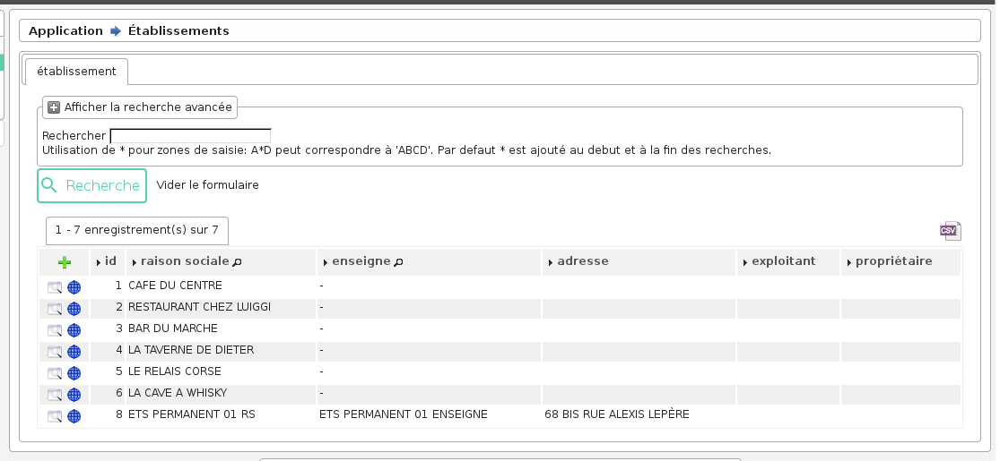
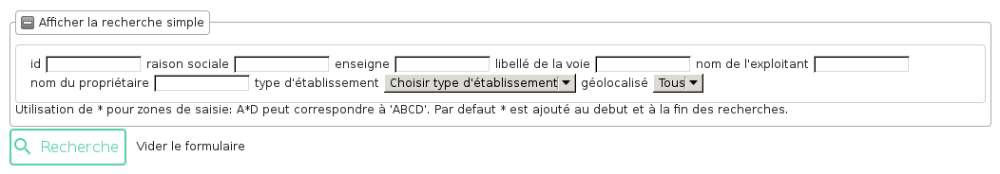
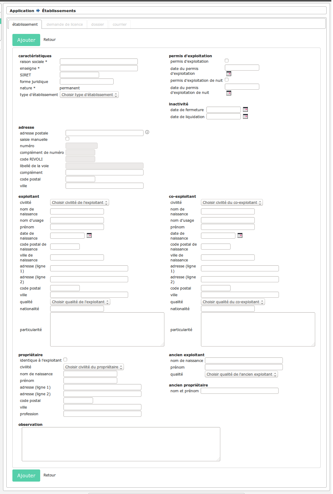
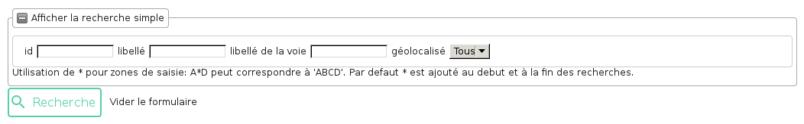
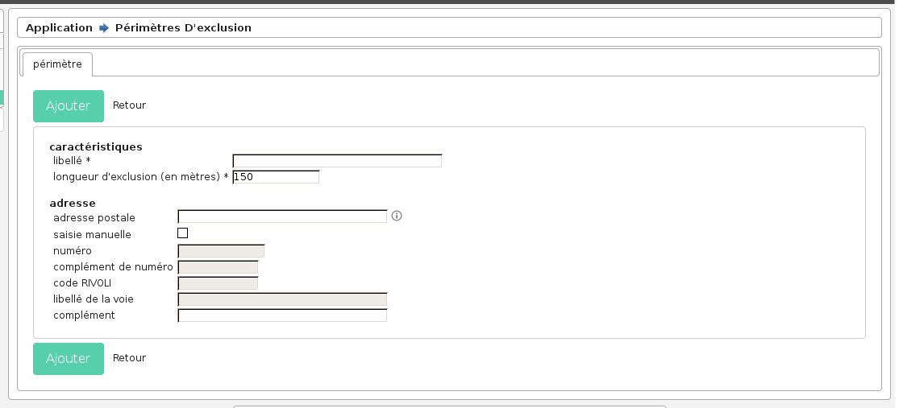
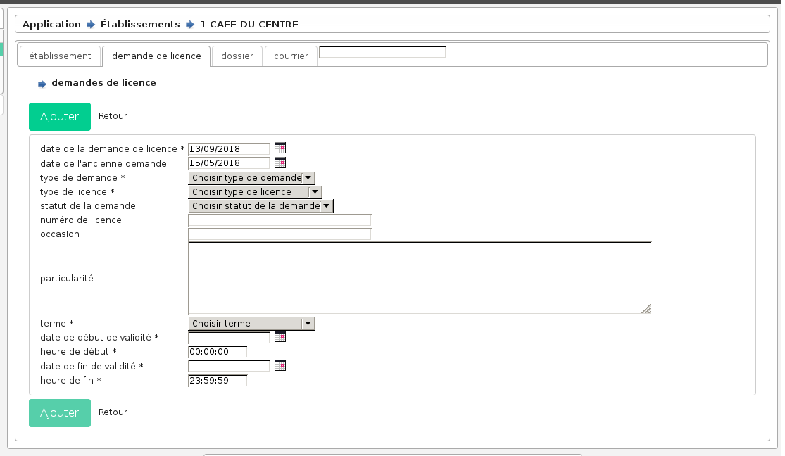
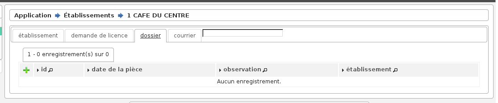
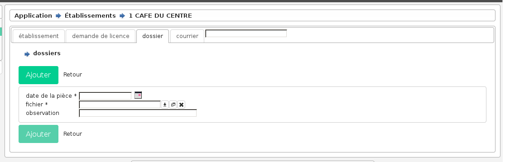

.. _instruction:

######################
Suivi de l'instruction
######################

***************
L'établissement
***************

Les actions/fonctions disponibles depuis le listing sont :

- Action "ajouter"
- Action "consulter"
- Action "géolocaliser"
- Recherche simple
- Recherche avancée
- Export CSV

====================
La recherche avancée
====================

=============================================
La saisie des informations d'un établissement
=============================================

Les champs sont les suivants :

- **Raison sociale** (obligatoire) : ...
- **Enseigne** (obligatoire) : ...
- Numéro Siret
- Forme juridique
- Permis d'exploitation (oui/non)
- Date du permis d'exploitation
- localisation (avec géolocalisation)
- Coordonnées de l'exploitant
- Coordonnées du propriétaire : il est possible de copier les valeurs de l'exploitant dans celles du propriétaire grâce à la case à cocher "Identique à l'exploitant"
- Date de fermeture/liquidation

.. image:: image11.jpeg

Trois nouveaux onglets sont actifs suite à la saisie :

- onglet Demande_licence : cet onglet permet de visualiser et d'ajouter des demandes de licences liées à cette établissement.
- onglet Dossier : cet onglet permet de visualiser et d'ajouter des documents liés à cette établissement.
- onglet Courrier : cet onglet permet de rédiger des courriers personnalisés pour cet établissement.

==============================================
Les spécificités d'un établissement temporaire
==============================================

Il existe un sous-type d'établissement (appelé établissement temporaire) qui est une variante plus simplifiée d'un établissement, non-géolocalisable, ne pouvant demander que des demandes de licences temporaire ou liée à un terrain de sport.

************************
Le périmètre d'exclusion
************************

Les actions/fonctions disponibles depuis le listing sont :

- Action "ajouter"
- Action "consulter"
- Action "géolocaliser"
- Recherche simple
- Recherche avancée
- Export CSV

====================
La recherche avancée
====================

=====================================================
La saisie des informations d'un périmètre d'exclusion
=====================================================

Les champs sont les suivants :

- **Libellé** (obligatoire) : ...
- **Longueur exclusion** (obligatoire) : ... . Au premier chargement du formulaire d'ajout, le champ est pré-rempli avec la valeur ``150``.
- Localisation

.. image:: image13.jpeg

*********************
La demande de licence
*********************

Depuis un établissement, l'onglet "Demandes de licence" permet de gérer les demandes rattachées à l'établissement.

===================================================
La saisie des informations d'une demande de licence
===================================================

Les champs sont les suivants : 

- **Date de la demande** (obligatoire) : ... . Au premier chargement du formulaire d'ajout, le champ est pré-rempli avec la date du jour.
- **Date de la précédente demande** : ... . Au premier chargement du formulaire d'ajout, le champ est pré-rempli avec la plus grande date de début de validité de toutes les demandes de licence de l'établissement.
- **Terme de la licence** (obligatoire) : (Permanente, Temporaire, Liée à un terrain de sport)
- **Date de début de validité de la licence** (obligatoire) : ...
- **Heure de début de validité de la licence** (obligatoire) : ... . Au premier chargement du formulaire d'ajout, le champ est pré-rempli avec la valeur ``00:00:00``.
- **Date de fin de validité de la licence** (obligatoire) : ...
- **Heure de fin de validité de la licence** (obligatoire) : ... . Au premier chargement du formulaire d'ajout, le champ est pré-rempli avec la valeur ``23:59:59``.
- **Occasion** : ...
- **Particularité** : ... . Au premier chargement du formulaire d'ajout, le champ est pré-rempli avec la valeur du champ 'particularité_exploitant' sur l'établissement rattaché.
- **Type de demande** (obligatoire) : (d'ouverture/de transfert/de mutation)
- **Type de licence** (obligatoire) : (catégorie 1/2/3/4, de grande restauration, etc...)

=========================================================================
Les spécificités de la demande de licence sur un établissement temporaire
=========================================================================

- Une demande sur un établissement temporaire est toujours de type "D''OUVERTURE".
- Une demande sur un établissement ne peut pas avoir un terme "Permanente".

===========================================================
Les possibilités de non-conformité d'une demande de licence
===========================================================

en rapport avec la géolocalisation
==================================

Il y a 2 cas :

• la distance entre la géolocalisation de l'établissement de la demande de licence concernée et toute les géolocalisations de périmètre interdit pour les demandes d'ouverture et de mutation permanente n'étant pas de première catégorie
• la distance entre la géolocalisation de l'établissement de la demande de licence concernée et toutes les géolocalisations des établissements possédant une licence de même type dont la période a au moins un jour de commun avec la période de la licence demandée

pour tous les établissements (même non-géolocalisés)
====================================================

Il y a 3 cas:

• pas plus de 5 demandes de licence temporaire par établissement par an.
• pas plus de 10 demandes de licence liée à un terrain de sport par établissement par an.
• l'établissement doit disposer d'un permis d'exploitation.

Un message d'erreur renseigne l'utilisateur dans ce cas.

.. image:: image18.jpeg

**********
Le dossier
**********

Depuis un établissement, l'onglet "Dossiers" permet de gérer les pièces (images ou pdf) rattachées à l'établissement.

Les actions/fonctions disponibles depuis le listing sont :

- Action “ajouter”
- Action “consulter”
- Action "télécharger la pièce"

=======================================
La saisie des informations d'un dossier
=======================================

Les champs sont les suivants : 

- **date de la pièce** (obligatoire) : ...
- **fichier** (obligatoire) : ...
- **observation** : ...

***********
Le courrier
***********

Depuis un établissement, l'onglet "Courriers" permet de gérer les courriers rattachés à l'établissement.

Les actions/fonctions disponibles depuis le listing sont :

- Action “ajouter”
- Action “consulter”
- Action "télécharger le courrier"

========================================
La saisie des informations d'un courrier
========================================

Les champs sont les suivants : 

- **date** : ...
- **modèle** (obligatoire) : ...
- **objet** : ...
- **corps** : ...

***********************
Vérification sur le SIG
***********************

Si le code rue existe et si le numéro dans la rue existe, il est possible de vérifier l'adresse dans le SIG en appuyant sur

.. image:: image16.png

.. image:: image17.jpeg

Voir manuel administrateur pour paramétrer le lien SIG (ici dynmap)

